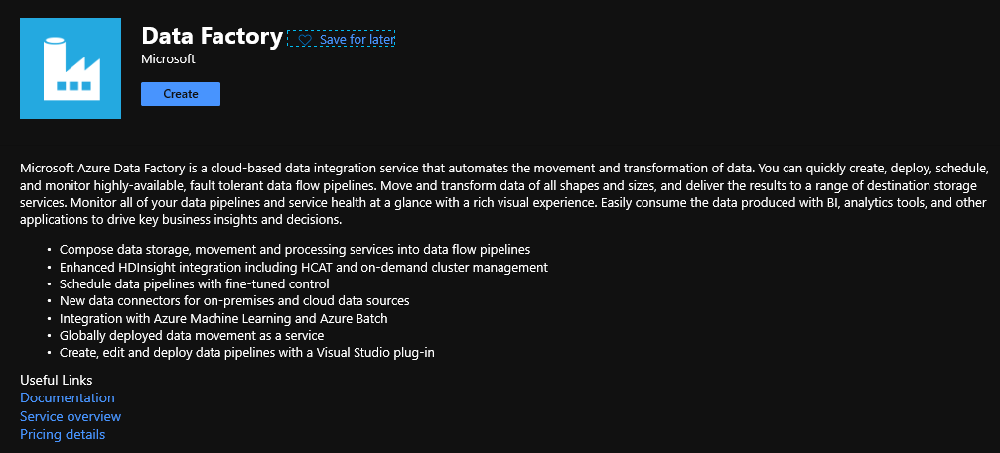
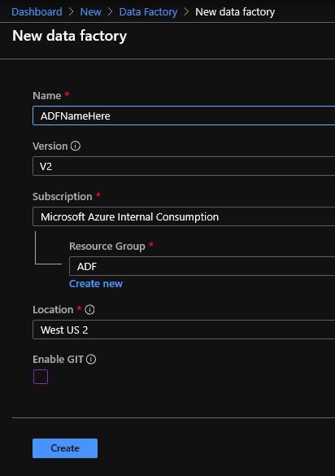
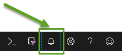
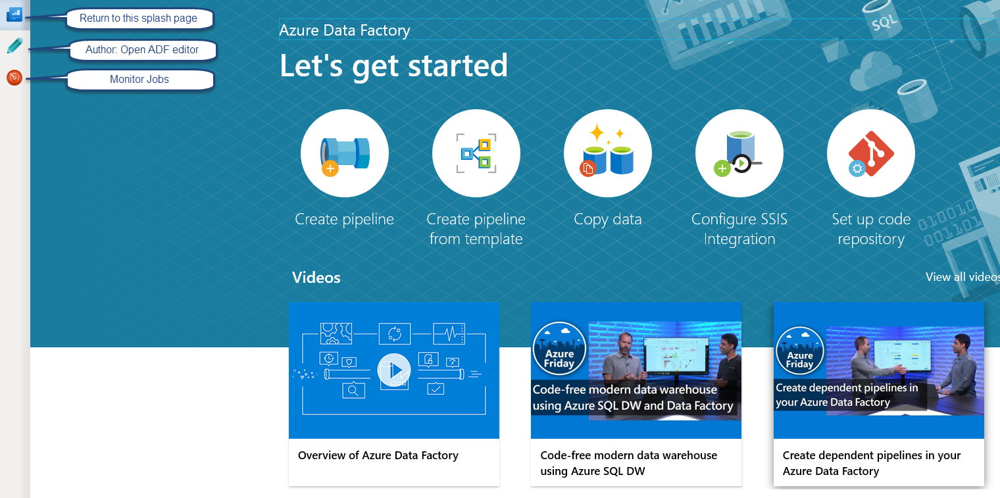
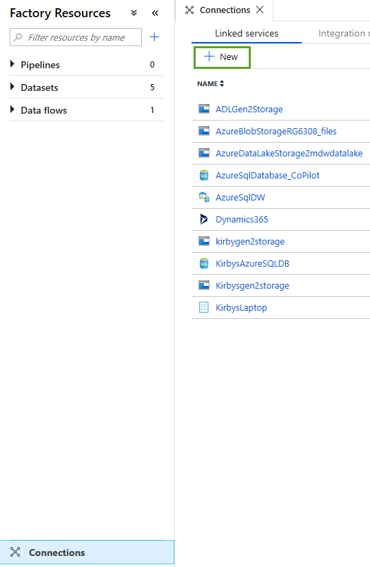
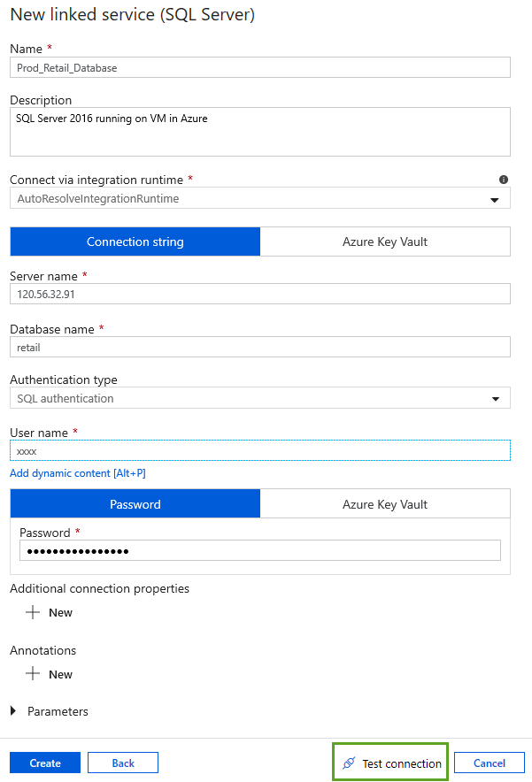

# Azure Data Factory Workshop

This site is a map of learning content produced by and curated by Kirby Repko. These materials are meant to be instructor-led, but you can work through the materials on a test system on your own if desired. You can view all materials directly in this interface, or you can [view the raw github site for this content here](https://github.com/krepko7/Azure-Data-Factory). 

## Azure Data Factory (ADF)

Create a new Data Factory.  Go to portal.azure.com and click the Create Resource menu item from top left menu.

Type "Data Factory" in the search box and click the create button.

Fill in the fields similar to below.

Remember when creating new resources in Azure to check the notifications bell icon at the top of the Azure Portal. It will tell you when reources are ready and allow you to quickly access them. 

Once your data factory is set up open it in Azure. Click the Author and Monitor button.

Here is a screen shot of the initial ADF splash page. Click the Author pencil on left.

Click the Connections menu item at the bottom left and then click New.

Pick the Database category and then pick SQL Server.

The name of your linked service is important since you will end up with many of these and will want to know what linked service points to what data source.
You will later create data sets based on these linked services. Make sure to test the connection before you proceed.

# Other labs you may be interested in.

## SQL Server Data Platform

- [Workshop: SQL Server Ground to Cloud](https://github.com/microsoft/sqlworkshops/tree/master/SQLGroundToCloud)
- [Workshop: SQL Server 2019 on OpenShift](https://github.com/Microsoft/sqlworkshops/tree/master/SQLonOpenShift)
- [Lab: SQL Server 2019](https://github.com/microsoft/sqlworkshops/tree/master/sql2019lab)

## Azure SQL 
- [Workshop: SQL Server Ground to Cloud](https://github.com/microsoft/sqlworkshops/tree/master/SQLGroundToCloud)
- [Lab: Microsoft Azure SQL Labs](https://github.com/microsoft/sqlworkshops/tree/master/AzureSQLLabs)

## Programming

- [Lab: Python for Data Professionals](https://github.com/Microsoft/sqlworkshops/tree/master/PythonForDataProfessionals)
- [Workshop: R for Data Professionals](https://github.com/Microsoft/sqlworkshops/tree/master/RForDataProfessionals)

## Machine Learning and AI

- [Workshop: SQL Server 2019 Big Data Clusters - Architecture](https://github.com/Microsoft/sqlworkshops/tree/master/sqlserver2019bigdataclusters)
- [Workshop: Machine Learning with SQL Server](https://github.com/Microsoft/sqlworkshops/tree/master/SQLServerMLServices)

## Learning how to self-learn

Many of these topics are quite deep, and take time to fully absorb. There are several phases of learning:

 - Awareness (You learn a technology exists and what it is used for)
 - Understanding (You learn the components, processes and steps of a technology)
 - Practice (You can perform the steps with the technology by following a process to complete a task)
 - Mastery (You are able to explain the technology to others)

These courses are designed for you to repeat many times to move through these phases. You may want to complete a "Learning how to Learn" course. <a href="https://www.nytimes.com/2017/08/04/education/edlife/learning-how-to-learn-barbara-oakley.html" target="_blank">You can find more information on that here</a>. 

*Disclaimer*

This project has adopted the [Microsoft Open Source Code of Conduct](https://opensource.microsoft.com/codeofconduct/). For more information see the [Code of Conduct FAQ](https://opensource.microsoft.com/codeofconduct/faq/) or contact [opencode@microsoft.com](mailto:opencode@microsoft.com) with any additional questions or comments.

